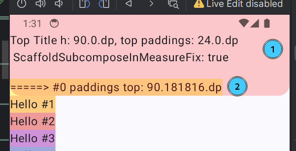
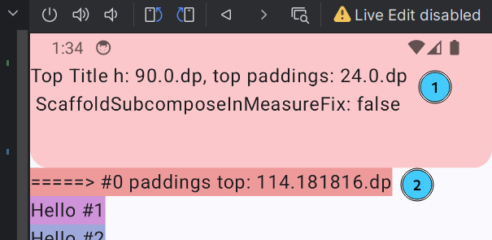

# ScaffoldIncorrectPadding
Minimal project to reproduce Scaffold bug with incorrect paddings calculation

When `ScaffoldSubcomposeInMeasureFix` is true, the padding values parameter sometimes appears in the 
content block of our Scaffold without the status bar padding
(sometimes the same thing happens with the bottom navigation paddings, but I'm not sure if it's related to that issue).

Due to this, the indentation for the first element is not calculated correctly and it climbs onto the top bar.

я 
The screenshot shows a scaffold with a top bar (marked as 1) and a lazy column in the content.
It can be seen that the top padding of the zero-element of lazy column (marked as 2) does not 
take the height of the status bar. This can also be seen from the text inside the top bar and the 
zero-element lazy column.

If the `ScaffoldSubcomposeInMeasureFix` flag is set to false, the height becomes correct:

First time problem got with migration from composeBom = "2024.01.00" to composeBom = "2024.02.00" 

# Versions

- Jetpack Compose version: composeBom = "2024.05.00"
- Material Library Version (M2, M3 or Both?): M3
- Material Compose component used: Scaffold + LazyColumn
- Android Studio Build: `#AI-233.14808.21.2331.11842104, built on May 15, 2024`
- Kotlin version: 1.9.0